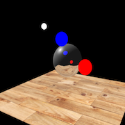
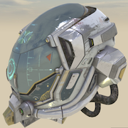
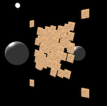
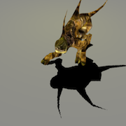
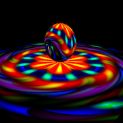
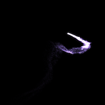

zen-3d
========

[![Latest NPM release][npm-badge]][npm-badge-url]
[![License][license-badge]][license-badge-url]
[![Issues][issues-badge]][issues-badge-url]
![Dev Dependencies][devDependencies-badge]

### JavaScript 3D library ###

The aim of the project is to create an easy to use, lightweight, 3D/2D library. The library only provides WebGL renderers.

[Examples](https://shawn0326.github.io/zen-3d/examples/) &mdash;
[RoadMap](https://trello.com/b/7Ie3DDBP) &mdash;
[Documentation](https://shawn0326.github.io/zen-3d/docs/) &mdash;
[Tests](https://shawn0326.github.io/zen-3d/tests/)

[](https://shawn0326.github.io/zen-3d/examples/#material_cubetexture_realtimeenvmap)
[](https://shawn0326.github.io/zen-3d/examples/#geometry_loader_gltf)
[](https://shawn0326.github.io/zen-3d/examples/#canvas2d_canvas2d)
[](https://shawn0326.github.io/zen-3d/examples/#webvr_car)
<br />
[](https://shawn0326.github.io/zen-3d/examples/#animation_monster)
[](https://shawn0326.github.io/zen-3d/examples/#sprite_sprites)
[](https://shawn0326.github.io/zen-3d/examples/#material_shadermaterial)
[](https://shawn0326.github.io/zen-3d/examples/#particle_particle)

### Usage ###

you can use `zen3d.js` or `zen3d.min.js` in your page simply by this:

````html
<script src="zen3d.min.js"></script>
````

### 3D Format Support ###

[GLTF](https://github.com/KhronosGroup/glTF) /
[assimp2json](https://github.com/acgessler/assimp2json)

### WebGL2 Support ###

* [Multiple Render Targets](https://shawn0326.github.io/zen-3d/examples/#custompass_gbuffer). (WebGL 1.0 extension / WebGL 2.0)
* [Instancing](https://shawn0326.github.io/zen-3d/examples/#webgl_instanced_draw). (WebGL 1.0 extension / WebGL 2.0)
* Vertex Array Object. (TODO)
* [Shader Texture LOD](https://shawn0326.github.io/zen-3d/examples/#material_cubetexture_skybox). (WebGL 1.0 extension / WebGL 2.0)
* Fragment Depth. (TODO)
* Transform Feedback. (TODO)
* Sampler Objects. (TODO)
* 3D Texture. (TODO)
* Multisampled Renderbuffers. (TODO)

### Build ###

* install [Node.js](https://nodejs.org) (include NPM).

* install devDependencies packages.

````
npm install
````

* you can run the following scripts

````
// build shader & zen3d
npm run default
// build zen3d
npm run build
// build extensions
npm run extension
// start a server to run examples
npm run example
````

build path is `./build`.

### About Me ###

* Blog: [Half Lab](http://www.halflab.me)
* Email: shawn0326@163.com
* Weibo: [@谢帅shawn](http://weibo.com/shawn0326)

[npm-badge]: https://img.shields.io/npm/v/zen-3d.svg
[npm-badge-url]: https://www.npmjs.com/package/zen-3d
[license-badge]: https://img.shields.io/npm/l/zen-3d.svg
[license-badge-url]: ./LICENSE
[issues-badge]: https://img.shields.io/github/issues/shawn0326/zen-3d.svg
[issues-badge-url]: https://github.com/shawn0326/zen-3d/issues
[devDependencies-badge]: https://img.shields.io/librariesio/github/shawn0326/zen-3d.svg