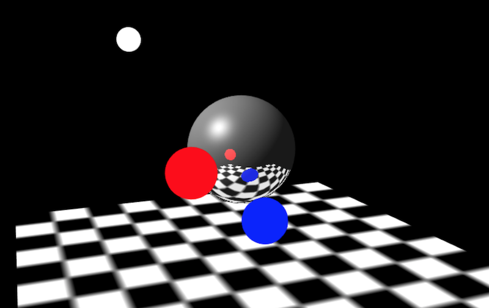

zen-3d
================================================
Current Version: NULL



JavaScript 3D library

一款WebGL 3D渲染器

RoadMap
--
[zen-3d RoadMap](https://trello.com/b/7Ie3DDBP)

Git:
--
* [github] https://github.com/shawn0326/zen-3d
* [coding] https://coding.net/u/shawn0326/p/zen-3d/git

Examples:
--
* [zen-3d Examples](http://shawn0326.coding.me/zen-3d/examples)

Usage
--
build path is `./build`, you can use `zen3d.js` or `zen3d.min.js` in your page simply by this:

````
<script src="zen3d.min.js"></script>    
````

Build
--
zen3d is built by [gulp](http://gulpjs.com/).

About Me
--
* Blog: [Half Lab](http://www.halflab.me)
* Email: shawn0326@163.com
* Weibo: [@谢帅shawn](http://weibo.com/shawn0326)
